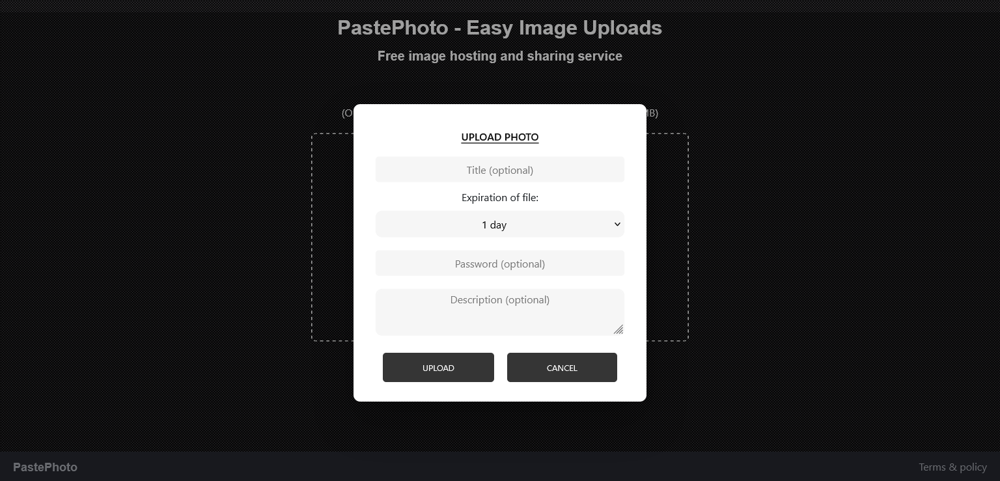

# PastePhoto

I created this project for the purpose of learning more about MariaDB, so I took inspiration from http://pasteboard.co to create this project. As I mentioned, I created this project for learning purposes, so this project might be not as good as it could be. In the near future I will improve this project.

## Screenshots

## Prerequisites

You will need the following things properly installed on your computer.

* **[MariaDB](https://mariadb.com/)** - MariaDB an open source relational database management system (DBMS) that is a compatible drop-in replacement for the widely used MySQL database technology.
* **[Git](https://git-scm.com/)** - Git is a version control system which helps in tracking changes in files and also in coordinating with number of people on same project.
* **[Node.js](https://nodejs.org/)** *(node v16.5.0)* *(with NPM v7.20.0)* - Node.js is a JavaScript runtime which is built on the top of chrome's v8 JavaScript engine. You can install Node.js easily with [nvm](https://github.com/creationix/nvm).

## Installation

* `git clone <repository-url>` this repository
* `cd WakeMeUp`
* `npm install` - This will install all the npm packages that are needed.
* `@echo off bin\mariadbd --console` - Run this command in your MariaDB folder to run it.
## Running

* `node server`
* Visit your app at [http://localhost:3000](http://localhost:3000).

Enjoy! :)
